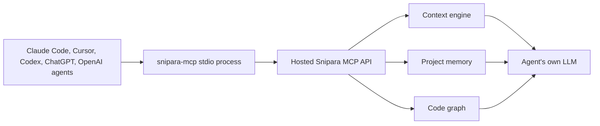

# snipara-mcp

[](https://pypi.org/project/snipara-mcp/)
[](https://www.python.org/downloads/)
[](https://opensource.org/licenses/MIT)

`snipara-mcp` is the lightweight stdio MCP connector for Snipara project memory
and context optimization.

**Memory belongs to the project, not the model.**

Use it when an MCP client needs a local stdio process that talks to Snipara's
hosted project memory and context optimization APIs. If your client supports
streamable HTTP MCP directly, prefer the hosted endpoint and skip the local
process.

## What Is Snipara?

Snipara is project-scoped persistent context for AI-assisted work.

It gives Claude Code, Cursor, Codex, OpenAI Agents, and other MCP-compatible
clients shared project intelligence that survives sessions, users, tools, and
model switches.

Your agent still uses its own LLM. Snipara gives it the right project context:
source-backed docs, reviewed memory, shared guidance, and code graph structure.

## Why MCP?

MCP is becoming a standard adapter layer for agent tools. `snipara-mcp` makes
Snipara available through that layer without forcing developers into a specific
IDE, model, or orchestration framework.

The integration should feel small:

```bash
uvx snipara-mcp
```

The impact is larger: agents can retrieve durable project context instead of
starting cold every session.

## What It Unlocks

| Need                                      | Snipara MCP tool group                                         |
| ----------------------------------------- | -------------------------------------------------------------- |
| Ask project docs a source-backed question | `rlm_context_query`, `rlm_get_chunk`                           |
| Recall durable decisions and learnings    | `rlm_recall`                                                   |
| Persist reusable memory after a task      | `rlm_remember`, `rlm_end_of_task_commit`                       |
| Reuse team standards and shared guidance  | `rlm_shared_context`                                           |
| Inspect structural code relationships     | `rlm_code_callers`, `rlm_code_imports`, `rlm_code_neighbors`   |
| Plan risky code changes                   | `rlm_code_symbol_card`, `rlm_code_impact` within plan capacity |

## Architecture



## Hosted HTTP Or Stdio?

Use the hosted HTTP endpoint when your MCP client supports streamable HTTP:

```json
{
  "mcpServers": {
    "snipara": {
      "type": "http",
      "url": "https://api.snipara.com/mcp/your-project-id-or-slug",
      "headers": {
        "Authorization": "Bearer snp-your-key"
      }
    }
  }
}
```

Use `snipara-mcp` when your client expects a local stdio command:

```json
{
  "mcpServers": {
    "snipara": {
      "command": "uvx",
      "args": ["snipara-mcp"],
      "env": {
        "SNIPARA_API_KEY": "snp-your-key",
        "SNIPARA_PROJECT_ID": "your-project-id-or-slug"
      }
    }
  }
}
```

Decision rule:

- HTTP MCP first for modern clients
- `snipara-mcp` for stdio-only clients or local compatibility
- `create-snipara` when you want guided setup across clients and templates

## Install

No local install:

```bash
uvx snipara-mcp
```

Python package:

```bash
pip install snipara-mcp
```

With RLM Runtime helper integration:

```bash
pip install "snipara-mcp[rlm]"
```

## Quickstart

Sign in through the browser:

```bash
pip install snipara-mcp
snipara login
```

Initialize a project:

```bash
snipara init
```

The initializer detects common project files, writes MCP configuration, and can
upload local project docs when you are authenticated.

Useful options:

```bash
snipara init --slug my-project
snipara init --dry-run
snipara init --no-upload
snipara init --skip-test
```

## Claude Code

```bash
claude mcp add snipara uvx snipara-mcp
```

Then export credentials in your shell:

```bash
export SNIPARA_API_KEY="snp-your-key"
export SNIPARA_PROJECT_ID="your-project-id-or-slug"
```

## Cursor

Add to `~/.cursor/mcp.json`:

```json
{
  "mcpServers": {
    "snipara": {
      "command": "uvx",
      "args": ["snipara-mcp"],
      "env": {
        "SNIPARA_API_KEY": "snp-your-key",
        "SNIPARA_PROJECT_ID": "your-project-id-or-slug"
      }
    }
  }
}
```

## Environment

| Variable               | Required                                 | Description                           |
| ---------------------- | ---------------------------------------- | ------------------------------------- |
| `SNIPARA_API_KEY`      | Yes, unless using `snipara login`        | Snipara API key                       |
| `SNIPARA_PROJECT_ID`   | Yes, unless using `SNIPARA_PROJECT_SLUG` | Project identifier                    |
| `SNIPARA_PROJECT_SLUG` | Yes, unless using `SNIPARA_PROJECT_ID`   | Project slug                          |
| `SNIPARA_API_URL`      | No                                       | Defaults to `https://api.snipara.com` |

OAuth tokens created by `snipara login` are stored in `~/.snipara/tokens.json`.
If a project id or slug is set, the connector selects the matching token and
does not silently fall back to another project.

## What You Get

The connector exposes the same MCP contract as the hosted backend. The packaged
tool surface is generated from the server source of truth.

Common tool groups:

- retrieval: `rlm_context_query`, `rlm_search`, `rlm_get_chunk`, `rlm_load_document`
- durable memory: `rlm_recall`, `rlm_remember`, `rlm_memory_compact`
- shared context: `rlm_shared_context`, collection and template tools
- document upload: `rlm_upload_document`, `rlm_sync_documents`
- project setup: client, project, and business-context workspace tools
- operations: `rlm_settings`, `rlm_index_health`, `rlm_reindex`
- code graph: `rlm_code_*` tools when code indexes are available
- coordination: swarm, hierarchical task, and state tools when enabled

Tool availability can vary by plan, hosted deployment, and project index state.

## CLI Commands

| Command          | Description                               |
| ---------------- | ----------------------------------------- |
| `snipara login`  | Browser login and token setup             |
| `snipara init`   | Initialize Snipara in the current project |
| `snipara logout` | Clear stored tokens                       |
| `snipara status` | Show auth and project status              |
| `snipara-mcp`    | Run the MCP stdio server                  |

Legacy aliases such as `snipara-init`, `snipara-mcp-login`,
`snipara-mcp-logout`, and `snipara-mcp-status` are still supported.

## Relationship To Other Repos

| Repo                     | Role                                  |
| ------------------------ | ------------------------------------- |
| `Snipara/snipara-server` | Hosted and self-hosted server surface |
| `alopez3006/snipara-mcp` | This stdio connector package          |
| `Snipara/snipara-memory` | Open memory primitives and schema     |

`snipara-mcp` is intentionally thin. It should be easy to install, easy to
audit, and boring to operate. The heavy lifting stays in Snipara's hosted
context and memory engine.

## Development

```bash
pip install -e ".[dev]"
pytest
ruff check .
```

The source of truth for the generated tool contract lives in the Snipara
server. When backend tools change, regenerate the packaged contract before
publishing this package.

## License

MIT. See [LICENSE](LICENSE).
