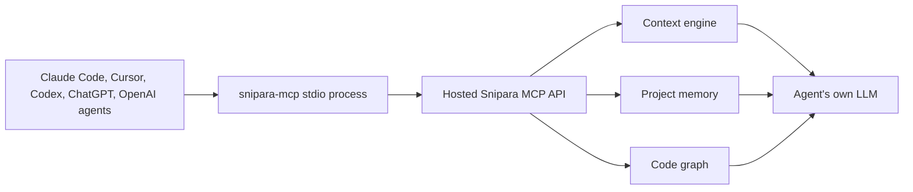

# snipara-mcp

[](https://pypi.org/project/snipara-mcp/)
[](https://www.python.org/downloads/)
[](https://opensource.org/licenses/MIT)
[](https://github.com/alopez3006/snipara-mcp/actions/workflows/ci.yml)

`snipara-mcp` is the lightweight stdio MCP connector for the Snipara Project
Brain.

**Snipara is the Project Brain for AI coding agents.**

Use it when an MCP client needs a local stdio process that talks to Snipara's
hosted Project Intelligence APIs. Snipara gives Claude Code, Cursor, Codex, and
other MCP clients the decisions, active work, code impact, proof, and handoffs
they need before they edit. If your client supports streamable HTTP MCP
directly, prefer the hosted endpoint and skip the local process.

## What Is Snipara?

Snipara is the shared Project Intelligence layer for AI-assisted software work.

It gives Claude Code, Cursor, Codex, OpenAI Agents, and other MCP-compatible
clients project context that survives sessions, users, tools, and
model switches.

Your agent still uses its own LLM. Snipara gives it the right project context:
source-backed docs, reviewed memory, shared guidance, workflow continuity, and
code graph structure. In category terms, it is an AI coding agent context,
memory, and continuity platform.

## Why MCP?

MCP is becoming a standard adapter layer for agent tools. `snipara-mcp` makes
Snipara available through that layer without forcing developers into a specific
IDE, model, or orchestration framework.

The integration should feel small:

```bash
uvx snipara-mcp
```

The impact is larger: agents can retrieve durable project context instead of
starting cold every session.

## What It Unlocks

| Need                                      | Snipara MCP tool group                                                                  |
| ----------------------------------------- | --------------------------------------------------------------------------------------- |
| Ask project docs a source-backed question | `snipara_context_query`, `snipara_get_chunk`                                            |
| Recall durable decisions and learnings    | `snipara_recall`                                                                        |
| Review the team Inbox                     | `snipara_inbox_review_queue`, `snipara_inbox_review_plan`, `snipara_inbox_review_apply` |
| Persist reusable memory after a task      | `snipara_remember_if_novel`, `snipara_end_of_task_commit`                               |
| Reuse team standards and shared guidance  | `snipara_shared_context`                                                                |
| Inspect structural code relationships     | `snipara_code_callers`, `snipara_code_imports`, `snipara_code_neighbors`                |
| Plan risky code changes                   | `snipara_code_symbol_card`, `snipara_code_impact` within plan capacity                  |

Public MCP clients should use the `snipara_*` names. The generated contract
retains `rlm_*` aliases for backward compatibility with older clients and
directory records.

The stdio server advertises the same compact default agent contract as the
hosted MCP endpoint. Set `SNIPARA_TOOL_PROFILE=full` only for clients that need
direct discovery of every specialist compatibility tool; hidden tools remain
callable by explicit name and discoverable through `snipara_help`.

The default discovery surface contains 13 coherent tools:
`snipara_context_query`, `snipara_ask`, `snipara_search`, `snipara_read`,
`snipara_stats`, `snipara_help`, `snipara_get_chunk`, `snipara_recall`,
`snipara_remember_if_novel`, `snipara_end_of_task_commit`,
`snipara_inbox_review_queue`, `snipara_inbox_review_plan`, and
`snipara_inbox_review_apply`.

### Configurable code-impact traversal (2.8.25)

The packaged `snipara_code_impact` contract now exposes `depth` (1-6),
`direction` (`in`, `out`, or `both`), and optional `edge_kinds`. This keeps the
connector contract aligned with hosted impact chains and Companion's hybrid
local/hosted traversal controls.

### Credential-free discovery and compact contract (2.8.24)

MCP clients and directory inspectors can now complete `initialize` and
`tools/list` before credentials are configured. Every actual tool call still
fails closed until authentication and project selection are present. The
default `tools/list` response exposes the same 13-tool core as hosted Snipara,
while `SNIPARA_TOOL_PROFILE=full` retains direct discovery of all specialist
compatibility tools. Core tools now include complete selection guidance,
behavior annotations, and nested parameter documentation for safer agent use.

### Agent-readable tool contracts (2.8.23)

The connector now preserves detailed tool descriptions and MCP behavior
annotations from the hosted source of truth. Summary, coordination, state,
memory, and code graph tools explain their prerequisites, access rules, side
effects, idempotence, alternatives, parameters, outputs, and common failure
modes so agents can choose them safely. Native output schemas remain deferred
until the transport and structured result format upgrade together.

### Unified conversational Inbox review (2.8.22)

Human team admins can list the same memory candidates and `ProjectDecision`
drafts shown by the multi-project Dashboard Inbox, create evidence-backed
approve/reject/needs-human recommendations, and atomically apply an explicitly
authorized snapshot. The service revalidates the human team-admin identity,
project ownership, current candidate states, and immutable item snapshots before
recording authority audits. Real credentials remain addressable for rejection
but are redacted from MCP output. The earlier ProjectDecision-only tools remain
available as specialist compatibility tools.

### Conversational decision review (2.8.21)

Agents can list pending `ProjectDecision` drafts, propose evidence-backed
approve/reject/needs-human recommendations, and apply an explicitly authorized
snapshot-bound plan. Apply requires a human project admin and fails closed if a
draft changed after planning; there is no live wildcard approval.

### Structured Why Capture task commits (2.8.20)

`snipara_end_of_task_commit` now accepts an atomic `why` block with `decision`,
`rationale`, `alternatives`, `constraints`, and `observed_outcome`. Structured
candidates stay pending until human review, and unknown parameters fail closed
instead of being silently ignored.

### Retrieval outcome controls (2.8.19)

The stdio connector forwards the hosted server's bounded retrieval-outcome
controls for `context_query` and `recall`: optional task correlation, shadow or
enabled rerank requests, and the strict context attribution window. The hosted
server remains authoritative, so a client request can lower or disable the
configured mode but cannot escalate it.

## Architecture



## Hosted HTTP Or Stdio?

Use the hosted HTTP endpoint when your MCP client supports streamable HTTP:

```json
{
  "mcpServers": {
    "snipara": {
      "type": "http",
      "url": "https://api.snipara.com/mcp/your-project-id-or-slug",
      "headers": {
        "Authorization": "Bearer snp-your-key"
      }
    }
  }
}
```

Use `snipara-mcp` when your client expects a local stdio command:

```json
{
  "mcpServers": {
    "snipara": {
      "command": "uvx",
      "args": ["snipara-mcp"],
      "env": {
        "SNIPARA_API_KEY": "snp-your-key",
        "SNIPARA_PROJECT_ID": "your-project-id-or-slug"
      }
    }
  }
}
```

Decision rule:

- HTTP MCP first for modern clients
- `snipara-mcp` for stdio-only clients or local compatibility
- `create-snipara` when you want guided setup across clients and templates

## Install

No local install:

```bash
uvx snipara-mcp
```

Python package:

```bash
pip install snipara-mcp
```

With RLM Runtime helper integration:

```bash
pip install "snipara-mcp[rlm]"
```

## Quickstart

Sign in through the browser:

```bash
pip install snipara-mcp
snipara login
```

Initialize a project:

```bash
snipara init
```

The initializer detects common project files, writes MCP configuration, and can
upload local project docs when you are authenticated.

Useful options:

```bash
snipara init --slug my-project
snipara init --dry-run
snipara init --no-upload
snipara init --skip-test
```

## Claude Code

```bash
claude mcp add snipara uvx snipara-mcp
```

Then export credentials in your shell:

```bash
export SNIPARA_API_KEY="snp-your-key"
export SNIPARA_PROJECT_ID="your-project-id-or-slug"
```

## Cursor

Add to `~/.cursor/mcp.json`:

```json
{
  "mcpServers": {
    "snipara": {
      "command": "uvx",
      "args": ["snipara-mcp"],
      "env": {
        "SNIPARA_API_KEY": "snp-your-key",
        "SNIPARA_PROJECT_ID": "your-project-id-or-slug"
      }
    }
  }
}
```

## Environment

| Variable               | Required                                 | Description                                               |
| ---------------------- | ---------------------------------------- | --------------------------------------------------------- |
| `SNIPARA_API_KEY`      | Yes, unless using `snipara login`        | Snipara API key                                           |
| `SNIPARA_PROJECT_ID`   | Yes, unless using `SNIPARA_PROJECT_SLUG` | Project identifier                                        |
| `SNIPARA_PROJECT_SLUG` | Yes, unless using `SNIPARA_PROJECT_ID`   | Project slug                                              |
| `SNIPARA_API_URL`      | No                                       | Defaults to `https://api.snipara.com`                     |
| `SNIPARA_TOOL_PROFILE` | No                                       | `core` by default; `full` exposes specialist tool schemas |

OAuth tokens created by `snipara login` are stored in `~/.snipara/tokens.json`.
If a project id or slug is set, the connector selects the matching token and
does not silently fall back to another project.

## What You Get

The connector exposes the same compact default MCP contract as the hosted
backend. The packaged full compatibility surface is generated from the server
source of truth and is available with `SNIPARA_TOOL_PROFILE=full`.

Common tool groups:

- retrieval: `snipara_context_query`, `snipara_search`, `snipara_get_chunk`,
  `snipara_load_document`
- durable memory: `snipara_recall`, `snipara_remember`,
  `snipara_memory_compact`
- owner-aware bootstrap: `snipara_session_memories`,
  `snipara_owner_profile_get`, `snipara_owner_profile_update`
- shared context: `snipara_shared_context`, collection and template tools
- document upload: `snipara_upload_document`, `snipara_sync_documents`
- project setup: client, project, and business-context workspace tools
- operations: `snipara_settings`, `snipara_index_health`, `snipara_reindex`
- code graph: `snipara_code_*` tools when code indexes are available
- coordination: swarm, hierarchical task, and state tools when enabled

Tool availability can vary by plan, hosted deployment, and project index state.

## CLI Commands

| Command          | Description                               |
| ---------------- | ----------------------------------------- |
| `snipara login`  | Browser login and token setup             |
| `snipara init`   | Initialize Snipara in the current project |
| `snipara logout` | Clear stored tokens                       |
| `snipara status` | Show auth and project status              |
| `snipara-mcp`    | Run the MCP stdio server                  |

Legacy aliases such as `snipara-init`, `snipara-mcp-login`,
`snipara-mcp-logout`, and `snipara-mcp-status` are still supported.

## Relationship To Other Repos

| Repo                        | Role                                                  |
| --------------------------- | ----------------------------------------------------- |
| `alopez3006/snipara-mcp`    | Current generated public connector mirror             |
| `Snipara/snipara-companion` | Local workflow, impact, verification, and handoff CLI |
| `Snipara/snipara-memory`    | Open memory primitives and schema                     |

`snipara-mcp` is intentionally thin. It should be easy to install, easy to
audit, and boring to operate. The heavy lifting stays in Snipara's hosted
context and memory engine.

## Development

```bash
pip install -e ".[dev]"
pytest
ruff check .
```

The source of truth for the generated tool contract lives in the Snipara
server. When backend tools change, regenerate the packaged contract before
publishing this package.

## License

MIT. See [LICENSE](LICENSE).
